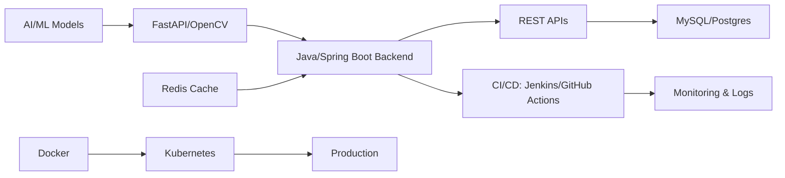

  

 

## 👩‍💻 About Me
**AI Backend Engineer** | **Full‑Stack Developer** | **Systems Thinker**

- ✅ Strong foundation in **Java**, **Spring Boot**, **Hibernate**, and **RESTful APIs**
- ✅ Experience integrating **AI/ML** workflows into backend services (e.g., FastAPI, OpenCV)
- ✅ Passion for **clean code**, **performance optimization**, and **system reliability**
- ✅ Constantly exploring **AI‑driven backend patterns**, from inference servers to pipeline orchestration

 

## 🛠 Tech Stack

    

 

## 📊 Quick Stats

  
  

 

## 🚀 Featured Projects

### 🌐 **Portfolio Website** *[Live Demo]*
> **Modern, responsive portfolio with smooth animations & SEO optimization**  
**Tech:** HTML5 • CSS3 • JavaScript • GitHub Pages • Responsive Design

---

### 🔎 **Java Face Detection** *[Computer Vision]*
> **Real‑time face detection using OpenCV with optimized Java processing**  
**Tech:** Java 17 • OpenCV 4.x • Image Processing • Multi‑threading

---

### 🌦️ **Weather Dashboard API** *[Production Ready]*
> **RESTful weather service with caching, rate limiting & real‑time updates**  
**Tech:** Python 3.11 • FastAPI • Redis • OpenWeatherMap • Docker

 

## 🔄 AI Backend Engineering Workflow

 

## 📈 Contribution Graph

 

&nbsp;

