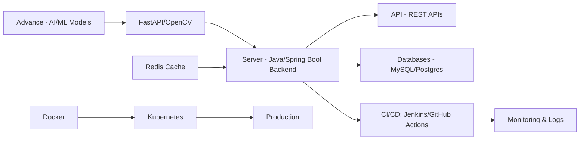

  

 

## 👩‍💻 About Me
**AI Backend Engineer** | **Tech Geek** | **Building in Progress**

- ✅ Strong foundation in **Java**, **Spring Boot**, **Hibernate**, and **RESTful APIs**
- ✅ Experience integrating **AI/ML** workflows into backend services (e.g., FastAPI, OpenCV)
- ✅ Passion for **clean code**, **performance optimization**, and **system reliability**
- ✅ Constantly exploring **AI‑driven backend patterns**, from inference servers to pipeline orchestration

 

## 🛠 Tech Stack

    

 

## 🚀 Featured Projects

### 🌐 **Portfolio Website** *[Live Demo]*
> **Modern, responsive portfolio with smooth animations & SEO optimization**  
**Tech:** HTML5 • CSS3 • JavaScript • GitHub Pages • Responsive Design

---

### 🔎 **Java Face Detection** *[Computer Vision]*
> **Real‑time face detection using OpenCV with optimized Java processing**  
**Tech:** Java 17 • OpenCV 4.x • Image Processing • Multi‑threading

---

### 📚 **Library Management API** *[CRUD Backend]*
> **Spring Boot REST API for managing books with full CRUD operations**  
**Tech:** Java • Spring Boot • Spring Data JPA • H2 Database • Postman

 

## 📈 Skills Snapshot - Underline are In Progress
- **Languages:** Java, Python, [SQL, JavaScript]  
- **Backend:** Spring Boot, [Hibernate, REST APIs, Microservices]  
- **AI/ML:** Python AI/ML stack, OpenCV, FastAPI, model serving  
- **Databases:** [MySQL, PostgreSQL], Redis  
- **DevOps:** Docker, Kubernetes, [Git], CI/CD, Linux  
- **Tools:** VS Code, IntelliJ/PyCharm, Git, Postman, [Docker Desktop] 

 

## 🔄 AI Backend Engineering Workflow

 

## 📬 Let’s Connect
For **collaborations**, **internships**, or **AI/backend projects**, feel free to reach out via:  
- LinkedIn: [amina-hasanaath-7033a1309](https://www.linkedin.com/in/amina-hasanaath-7033a1309)  
- GitHub: [AminaHasanaath](https://github.com/AminaHasanaath)  
- Portfolio: [AminaHasanaath.github.io](https://AminaHasanaath.github.io)
